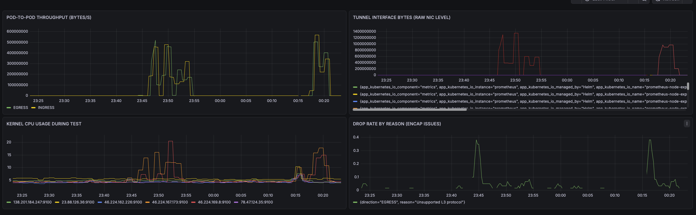
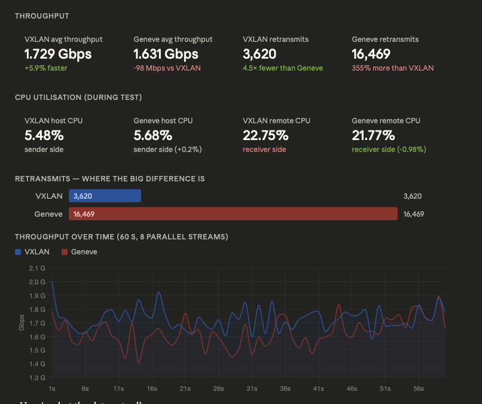
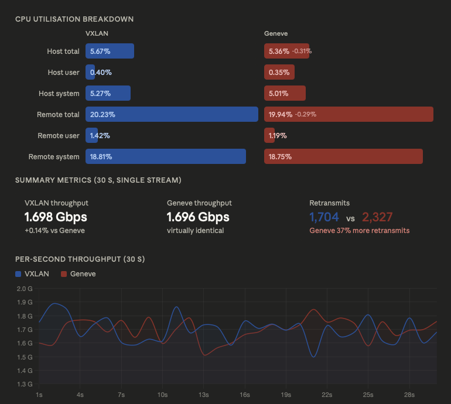
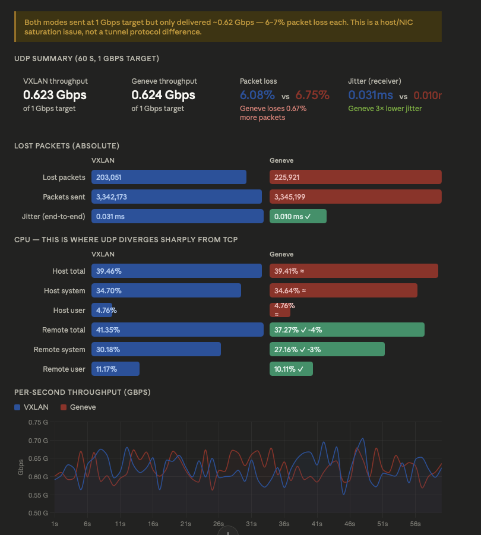
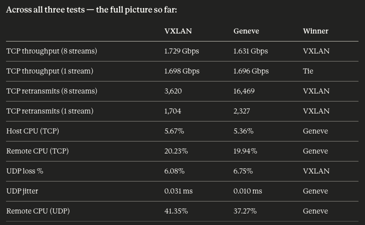

## benchmarking different components

1. default installation - start with kube-proxy replacement as true and cluster-pool as IPAM.

```yaml
k8sServiceHost: 138.199.130.234
k8sServicePort: 6443
kubeProxyReplacement: true

ipam:
  mode: "cluster-pool"
  operator:
    clusterPoolIPv4PodCIDRList: 10.0.0.0/8   # overall pool
    clusterPoolIPv4MaskSize: 24               # per-node slice
```

```bash
kubectl -n kube-system exec ds/cilium -- cilium-dbg status --all-addresses
KVStore:                Disabled   
Kubernetes:             Ok         1.35 (v1.35.3) [linux/amd64]
Kubernetes APIs:        ["cilium/v2::CiliumCIDRGroup", "cilium/v2::CiliumClusterwideNetworkPolicy", "cilium/v2::CiliumEndpoint", "cilium/v2::CiliumNetworkPolicy", "cilium/v2::CiliumNode", "core/v1::Pods", "networking.k8s.io/v1::NetworkPolicy"]
KubeProxyReplacement:   True   [eth0   46.224.169.8 fe80::9000:7ff:fe71:c2ba (Direct Routing)]
Host firewall:          Disabled
SRv6:                   Disabled
CNI Chaining:           none
CNI Config file:        successfully wrote CNI configuration file to /host/etc/cni/net.d/05-cilium.conflist
Cilium:                 Ok   1.19.1 (v1.19.1-d0d0c879)
NodeMonitor:            Listening for events on 2 CPUs with 64x4096 of shared memory
Cilium health daemon:   Ok   
IPAM:                   IPv4: 3/254 allocated from 10.0.0.0/24, 
Allocated addresses:
  10.0.0.120 (kube-system/coredns-7d764666f9-6qx5x)
  10.0.0.141 (router)
  10.0.0.78 (health)
IPv4 BIG TCP:               Disabled
IPv6 BIG TCP:               Disabled
BandwidthManager:           Disabled
Routing:                    Network: Tunnel [vxlan]   Host: Legacy
Attach Mode:                TCX
Device Mode:                veth
Masquerading:               IPTables [IPv4: Enabled, IPv6: Disabled]
Controller Status:          19/19 healthy
Proxy Status:               OK, ip 10.0.0.141, 0 redirects active on ports 10000-20000, Envoy: external
Global Identity Range:      min 256, max 65535
Hubble:                     Ok               Current/Max Flows: 538/4095 (13.14%), Flows/s: 3.51   Metrics: Disabled
Encryption:                 Disabled         
Cluster health:             5/6 reachable    (2026-03-26T08:59:03Z)   (Probe interval: 2m33.896961447s)
Name                        IP               Node                     Endpoints
  kubernetes/k8s-worker01   46.224.162.226   0/1                      1/1
Modules Health:             Stopped(23) Degraded(0) OK(77)
```

so by default we have these configs:
```bash
KVStore:                Disabled
KubeProxyReplacement:   True
Host firewall:          Disabled
SRv6:                   Disabled
IPv4 BIG TCP:           Disabled
IPv6 BIG TCP:           Disabled
BandwidthManager:       Disabled
Routing:                Network: Tunnel [vxlan]
Masquerading:           IPTables [IPv4: Enabled, IPv6: Disabled]
```


## enable Gateway API

### install gateway api CRDs

```bash
kubectl apply --server-side -f https://github.com/kubernetes-sigs/gateway-api/releases/download/v1.4.1/standard-install.yaml
```

```yaml
gatewayAPI:
  enabled: true
```

```bash
cilium upgrade --set gatewayAPI.enabled=true  --reuse-values
```

```yaml
k8sServiceHost: 138.199.130.234
k8sServicePort: 6443
kubeProxyReplacement: true

ipam:
  mode: "cluster-pool"
  operator:
    clusterPoolIPv4PodCIDRList: 10.0.0.0/8   # overall pool
    clusterPoolIPv4MaskSize: 24               # per-node slic

gatewayAPI:
  enabled: true

prometheus:
  enabled: true

operator:
  prometheus:
    enabled: true

hubble:
  enabled: true
  metrics:
    enableOpenMetrics: true
```

---
## VXLAN vs Geneve

```yaml
# VXLAN mode
tunnelProtocol: vxlan
routingMode: tunnel

# Geneve mode (recommended, Cilium default)
tunnelProtocol: geneve
routingMode: tunnel
```

```bash
kubectl -n kube-system exec -ti ds/cilium -- cilium status | grep -i tunnel
Routing:                 Network: Tunnel [vxlan]   Host: Legacy
```


```yaml
apiVersion: apps/v1
kind: DaemonSet
metadata:
  name: iperf3-server
  namespace: benchmark
spec:
  selector:
    matchLabels:
      app: iperf3-server
  template:
    metadata:
      labels:
        app: iperf3-server
    spec:
      containers:
      - name: iperf3
        image: networkstatic/iperf3
        args: ["-s"]
        ports:
        - containerPort: 5201
        resources:
          requests:
            cpu: "500m"
            memory: "64Mi"
```

establish a baseline with iperf3 (cross-node pods only — same-node bypasses tunnels entirely via eBPF) + snapshot Prometheus counters before touching anything

```bash
root@iperf3-server-cbj7f:/# iperf3 -c 10.0.3.10 -t 60 -P 8 -J > tcp_throughput_baseline.json
root@iperf3-server-cbj7f:/# iperf3 -c 10.0.3.10 -t 30 -P 4 --get-server-output -J > cpu_baseline.json
root@iperf3-server-cbj7f:/# iperf3 -c 10.0.3.10 -u -b 1G -t 60 -J > udp_baseline.json
```

### change to geneve

```bash
kubectl -n kube-system exec -ti ds/cilium -- cilium status | grep -i tunnel
Routing:                    Network: Tunnel [geneve]   Host: Legacy
```

### result -- VXLAN vs Geneve
Dashboard graph between switching modes


Here's what the data actually says:
#### tcp_throughput_baseline


VXLAN wins on throughput, but the retransmit story is the real finding.

Throughput-wise VXLAN leads by ~98 Mbps (1.729 vs 1.631 Gbps, ~6%). That's real but not dramatic — both are on the same physical hardware so this is unlikely to be purely the protocol. The CPU numbers are essentially a wash (both sides within 1%).


#### cpu_baseline



CPU: Geneve is marginally cheaper, not more expensive
Geneve used slightly less CPU on both sides — host total 5.36% vs 5.67%, remote total 19.94% vs 20.23%. The differences are small enough (~0.3%) to be noise, but the important thing is: Geneve is definitively not burning more CPU than VXLAN. Any concern that Geneve's TLV header processing adds overhead on your hardware is not supported by the data.
The dominant cost in both cases is system CPU (kernel), not user CPU — host system is ~5% while user is ~0.4%. That's expected: encap/decap and eBPF processing all happen in kernel space. Both protocols hit the kernel the same way.

Throughput: essentially identical at this stream count
1.698 vs 1.696 Gbps is noise — 0.14% apart. Compare this to the 8-stream test where VXLAN led by 6%. That gap shrinks dramatically with a single stream, which suggests the earlier difference was driven by TCP congestion dynamics and queue depth under parallel load, not the tunnel protocol itself.

#### udp_baseline



The UDP results flip the script in an interesting way. Here's the breakdown:
Throughput and loss: effectively a draw, both hitting a wall
Both modes delivered ~0.623 Gbps against a 1 Gbps target — meaning ~38% of UDP packets were dropped before they even counted as lost at the receiver. The sender-side CPU tells the story: both hit ~39.5% host CPU, with ~34.7% of that in kernel/system space. You're saturating the iperf3 sender's ability to generate UDP at 1 Gbps, not the tunnel. The per-second chart confirms this — both traces are nearly indistinguishable, hovering in the same 0.55–0.70 Gbps band throughout.

Jitter: Geneve wins clearly — 0.010 ms vs 0.031 ms
This is the one clean signal in the UDP data. Geneve's receiver-side jitter is 3× lower than VXLAN's. Jitter measures variance in packet arrival timing — lower is better for any latency-sensitive workload (DNS, gRPC, real-time telemetry). This is consistent with Geneve's TLV metadata allowing the receiver to make faster forwarding decisions without an extra eBPF map lookup.
Receiver CPU: Geneve wins meaningfully — 37.3% vs 41.4%

This is the biggest concrete advantage Geneve has shown across all your tests. The receiver (decap side) uses 4% less total CPU under UDP flood, entirely driven by a 3% reduction in kernel/system time. This is exactly what you'd expect from Geneve's native identity embedding: fewer eBPF map lookups on the receive path = less kernel work per packet.




---
