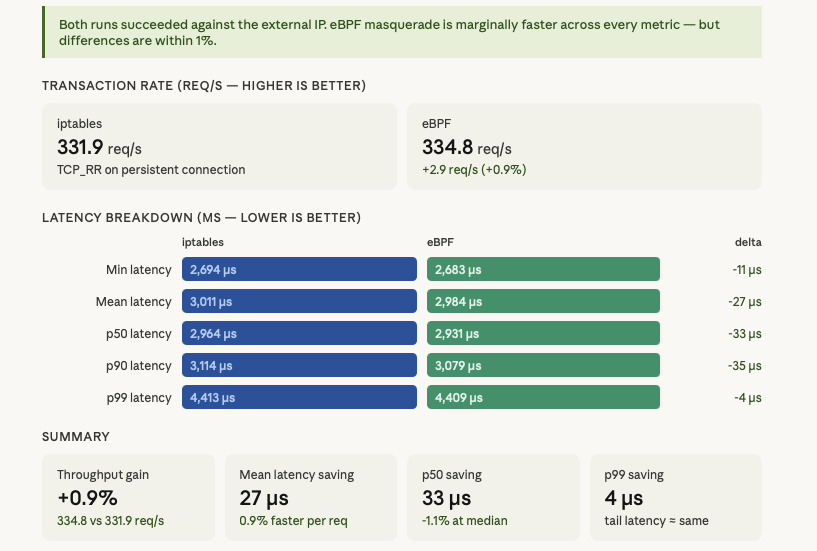
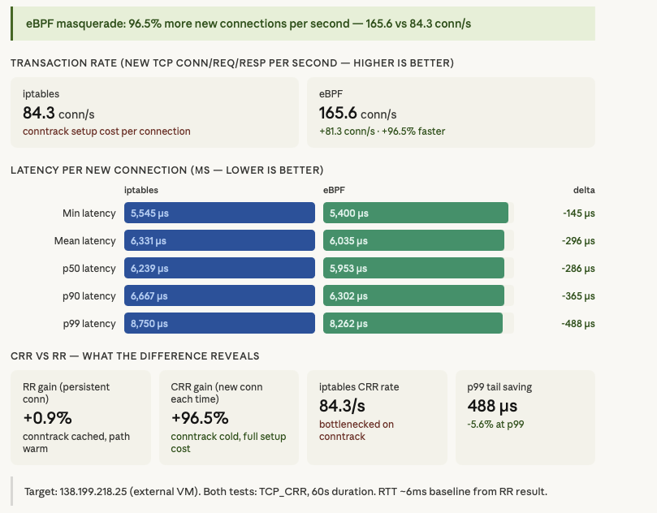
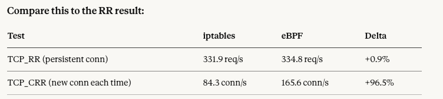
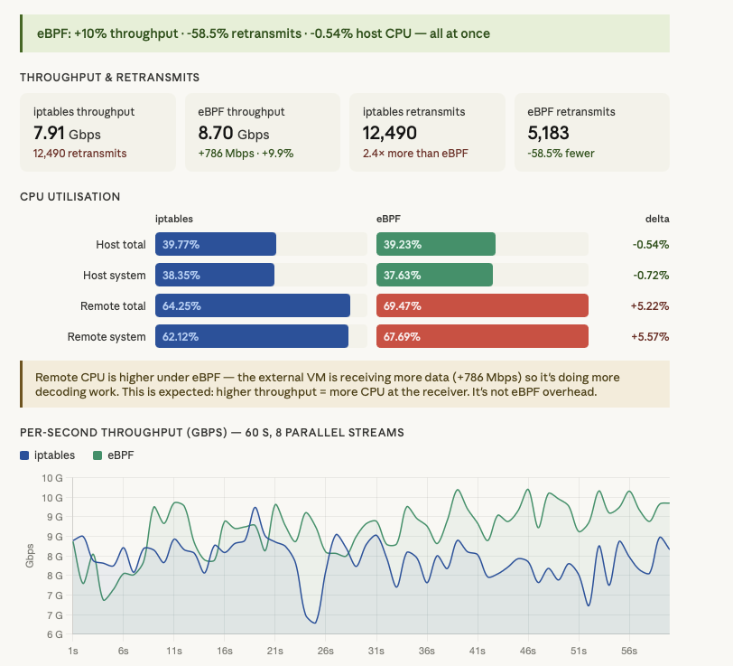

## benchmarking different components

1. default installation - start with kube-proxy replacement as true and cluster-pool as IPAM.

```yaml
k8sServiceHost: 138.199.130.234
k8sServicePort: 6443
kubeProxyReplacement: true

ipam:
  mode: "cluster-pool"
  operator:
    clusterPoolIPv4PodCIDRList: 10.0.0.0/8   # overall pool
    clusterPoolIPv4MaskSize: 24               # per-node slice
```

```bash
kubectl -n kube-system exec ds/cilium -- cilium-dbg status --all-addresses
KVStore:                Disabled   
Kubernetes:             Ok         1.35 (v1.35.3) [linux/amd64]
Kubernetes APIs:        ["cilium/v2::CiliumCIDRGroup", "cilium/v2::CiliumClusterwideNetworkPolicy", "cilium/v2::CiliumEndpoint", "cilium/v2::CiliumNetworkPolicy", "cilium/v2::CiliumNode", "core/v1::Pods", "networking.k8s.io/v1::NetworkPolicy"]
KubeProxyReplacement:   True   [eth0   46.224.169.8 fe80::9000:7ff:fe71:c2ba (Direct Routing)]
Host firewall:          Disabled
SRv6:                   Disabled
CNI Chaining:           none
CNI Config file:        successfully wrote CNI configuration file to /host/etc/cni/net.d/05-cilium.conflist
Cilium:                 Ok   1.19.1 (v1.19.1-d0d0c879)
NodeMonitor:            Listening for events on 2 CPUs with 64x4096 of shared memory
Cilium health daemon:   Ok   
IPAM:                   IPv4: 3/254 allocated from 10.0.0.0/24, 
Allocated addresses:
  10.0.0.120 (kube-system/coredns-7d764666f9-6qx5x)
  10.0.0.141 (router)
  10.0.0.78 (health)
IPv4 BIG TCP:               Disabled
IPv6 BIG TCP:               Disabled
BandwidthManager:           Disabled
Routing:                    Network: Tunnel [vxlan]   Host: Legacy
Attach Mode:                TCX
Device Mode:                veth
Masquerading:               IPTables [IPv4: Enabled, IPv6: Disabled]
Controller Status:          19/19 healthy
Proxy Status:               OK, ip 10.0.0.141, 0 redirects active on ports 10000-20000, Envoy: external
Global Identity Range:      min 256, max 65535
Hubble:                     Ok               Current/Max Flows: 538/4095 (13.14%), Flows/s: 3.51   Metrics: Disabled
Encryption:                 Disabled         
Cluster health:             5/6 reachable    (2026-03-26T08:59:03Z)   (Probe interval: 2m33.896961447s)
Name                        IP               Node                     Endpoints
  kubernetes/k8s-worker01   46.224.162.226   0/1                      1/1
Modules Health:             Stopped(23) Degraded(0) OK(77)
```

so by default we have these configs:
```bash
KVStore:                Disabled
KubeProxyReplacement:   True
Host firewall:          Disabled
SRv6:                   Disabled
IPv4 BIG TCP:           Disabled
IPv6 BIG TCP:           Disabled
BandwidthManager:       Disabled
Routing:                Network: Tunnel [vxlan]
Masquerading:           IPTables [IPv4: Enabled, IPv6: Disabled]
```


## enable Gateway API

### install gateway api CRDs

```bash
kubectl apply --server-side -f https://github.com/kubernetes-sigs/gateway-api/releases/download/v1.4.1/standard-install.yaml
```

```yaml
gatewayAPI:
  enabled: true
```

```bash
cilium upgrade --set gatewayAPI.enabled=true  --reuse-values
```

```yaml
k8sServiceHost: 138.199.130.234
k8sServicePort: 6443
kubeProxyReplacement: true

ipam:
  mode: "cluster-pool"
  operator:
    clusterPoolIPv4PodCIDRList: 10.0.0.0/8   # overall pool
    clusterPoolIPv4MaskSize: 24               # per-node slic

gatewayAPI:
  enabled: true

prometheus:
  enabled: true

operator:
  prometheus:
    enabled: true

hubble:
  enabled: true
  metrics:
    enableOpenMetrics: true
```

---
## VXLAN vs Geneve

```yaml
# VXLAN mode
tunnelProtocol: vxlan
routingMode: tunnel

# Geneve mode (recommended, Cilium default)
tunnelProtocol: geneve
routingMode: tunnel
```

```bash
kubectl -n kube-system exec -ti ds/cilium -- cilium status | grep -i tunnel
Routing:                 Network: Tunnel [vxlan]   Host: Legacy
```


```yaml
apiVersion: apps/v1
kind: DaemonSet
metadata:
  name: iperf3-server
  namespace: benchmark
spec:
  selector:
    matchLabels:
      app: iperf3-server
  template:
    metadata:
      labels:
        app: iperf3-server
    spec:
      containers:
      - name: iperf3
        image: networkstatic/iperf3
        args: ["-s"]
        ports:
        - containerPort: 5201
        resources:
          requests:
            cpu: "500m"
            memory: "64Mi"
```

establish a baseline with iperf3 (cross-node pods only — same-node bypasses tunnels entirely via eBPF) + snapshot Prometheus counters before touching anything

```bash
root@iperf3-server-cbj7f:/# iperf3 -c 10.0.3.10 -t 60 -P 8 -J > tcp_throughput_baseline.json
root@iperf3-server-cbj7f:/# iperf3 -c 10.0.3.10 -t 30 -P 4 --get-server-output -J > cpu_baseline.json
root@iperf3-server-cbj7f:/# iperf3 -c 10.0.3.10 -u -b 1G -t 60 -J > udp_baseline.json
```

### change to geneve

```bash
kubectl -n kube-system exec -ti ds/cilium -- cilium status | grep -i tunnel
Routing:                    Network: Tunnel [geneve]   Host: Legacy
```

### result -- VXLAN vs Geneve
Dashboard graph between switching modes


Here's what the data actually says:

#### tcp_throughput_baseline


VXLAN wins on throughput, but the retransmit story is the real finding.

Throughput-wise VXLAN leads by ~98 Mbps (1.729 vs 1.631 Gbps, ~6%). That's real but not dramatic — both are on the same physical hardware so this is unlikely to be purely the protocol. The CPU numbers are essentially a wash (both sides within 1%).


#### cpu_baseline


CPU: Geneve is marginally cheaper, not more expensive
Geneve used slightly less CPU on both sides — host total 5.36% vs 5.67%, remote total 19.94% vs 20.23%. The differences are small enough (~0.3%) to be noise, but the important thing is: Geneve is definitively not burning more CPU than VXLAN. Any concern that Geneve's TLV header processing adds overhead on your hardware is not supported by the data.
The dominant cost in both cases is system CPU (kernel), not user CPU — host system is ~5% while user is ~0.4%. That's expected: encap/decap and eBPF processing all happen in kernel space. Both protocols hit the kernel the same way.

Throughput: essentially identical at this stream count
1.698 vs 1.696 Gbps is noise — 0.14% apart. Compare this to the 8-stream test where VXLAN led by 6%. That gap shrinks dramatically with a single stream, which suggests the earlier difference was driven by TCP congestion dynamics and queue depth under parallel load, not the tunnel protocol itself.

#### udp_baseline


The UDP results flip the script in an interesting way. Here's the breakdown:
Throughput and loss: effectively a draw, both hitting a wall
Both modes delivered ~0.623 Gbps against a 1 Gbps target — meaning ~38% of UDP packets were dropped before they even counted as lost at the receiver. The sender-side CPU tells the story: both hit ~39.5% host CPU, with ~34.7% of that in kernel/system space. You're saturating the iperf3 sender's ability to generate UDP at 1 Gbps, not the tunnel. The per-second chart confirms this — both traces are nearly indistinguishable, hovering in the same 0.55–0.70 Gbps band throughout.

Jitter: Geneve wins clearly — 0.010 ms vs 0.031 ms
This is the one clean signal in the UDP data. Geneve's receiver-side jitter is 3× lower than VXLAN's. Jitter measures variance in packet arrival timing — lower is better for any latency-sensitive workload (DNS, gRPC, real-time telemetry). This is consistent with Geneve's TLV metadata allowing the receiver to make faster forwarding decisions without an extra eBPF map lookup.
Receiver CPU: Geneve wins meaningfully — 37.3% vs 41.4%

This is the biggest concrete advantage Geneve has shown across all your tests. The receiver (decap side) uses 4% less total CPU under UDP flood, entirely driven by a 3% reduction in kernel/system time. This is exactly what you'd expect from Geneve's native identity embedding: fewer eBPF map lookups on the receive path = less kernel work per packet.


---

## Masquerading - modes

### legacy (ip-tables) vs eBPF

default is IPTables:

```bash
kubectl -n kube-system exec ds/cilium -- cilium-dbg status | grep Masquerading
Masquerading:            IPTables [IPv4: Enabled, IPv6: Disabled]
```

Why masquerading mode matters more than tunnel mode

Masquerading (SNAT) touches every packet leaving the cluster — egress to external services, DNS, API calls, internet traffic. Unlike the tunnel protocol which only matters for pod-to-pod cross-node traffic, masquerading is in the hot path for all outbound flows. The performance difference here is more impactful in practice.

```bash
kubectl -n kube-system get cm cilium-config -o json | jq '{masquerade: .data["enable-bpf-masquerade"], ipv4_masq: .data["enable-ipv4-masquerade"]}'                                        
{
  "masquerade": null,
  "ipv4_masq": "true"
}
```

Count current iptables MASQUERADE rules (should be non-zero in iptables mode)

```bash
kubectl -n kube-system exec -ti ds/cilium -- iptables -t nat -L CILIUM_POST_nat -n --line-numbers | grep -c MASQUERADE 
1

```

```yaml
apiVersion: v1
kind: Pod
metadata:
  name: iperf3-host-server
  namespace: benchmark
spec:
  hostNetwork: true        # uses node IP — guaranteed outside pod CIDR
  nodeName: k8s-worker01        # pin to a specific node
  containers:
  - name: iperf3
    image: networkstatic/iperf3
    args: ["-s"]
    ports:
    - containerPort: 5201
      hostPort: 5201
```

```yaml
apiVersion: v1
kind: Pod
metadata:
  name: iperf3-client
  namespace: benchmark
spec:
  nodeName: k8s-worker02
  containers:
  - name: netperf
    image: cilium/netperf      # has netperf + iperf3 both
    command: ["sleep", "infinity"]
    resources:
      requests:
        cpu: "1"
        memory: "128Mi"
```


While running traffic from the client pod, verify SNAT is happening On node-2 — confirm packets leave with node IP, not pod IP
`tcpdump -i eth0 -nn host $NODE_IP and port 5201 | head -5`

You should see node-2's IP as source, NOT the pod IP (10.x.x.x)
46.224.162.226 >> k8s-worker01 (server)
46.224.169.8 >> k8s-worker02   (client)


```bash
[root@k8s-worker02 /]# tcpdump -i eth0 -nn host 46.224.162.226 and port 5201 | head -5
dropped privs to tcpdump
tcpdump: verbose output suppressed, use -v[v]... for full protocol decode
listening on eth0, link-type EN10MB (Ethernet), snapshot length 262144 bytes
08:20:51.270186 IP 46.224.169.8.36434 > 46.224.162.226.5201: Flags [P.], seq 3653186401:3653250709, ack 458657233, win 507, options [nop,nop,TS val 946123656 ecr 3990235764], length 64308
08:20:51.270203 IP 46.224.169.8.36408 > 46.224.162.226.5201: Flags [P.], seq 1069044328:1069091860, ack 3188691587, win 507, options [nop,nop,TS val 946123657 ecr 3990235763], length 47532
08:20:51.270222 IP 46.224.169.8.36384 > 46.224.162.226.5201: Flags [P.], seq 3440146689:3440205405, ack 667696519, win 507, options [nop,nop,TS val 946123656 ecr 3990235763], length 58716
08:20:51.270240 IP 46.224.169.8.36382 > 46.224.162.226.5201: Flags [P.], seq 313730858:313795166, ack 2714397075, win 507, options [nop,nop,TS val 946123656 ecr 3990235763], length 64308
08:20:51.270276 IP 46.224.169.8.36398 > 46.224.162.226.5201: Flags [P.], seq 3542194071:3542258379, ack 3744779722, win 507, options [nop,nop,TS val 946123656 ecr 3990235763], length 64308
```

### TEST A — TCP THROUGHPUT
```bash
kubectl exec -n benchmark iperf3-client -- iperf3 -c 46.224.162.226 -t 60 -P 8 -J > tcp_masq_iptables.json
```

### TEST B — CONNECTION RATE (TCP_CRR) VIA NETPERF

Deploy netperf server on node-1 (hostNetwork)

```bash
kubectl run netperf-host -n benchmark --image=cilium/netperf --restart=Never --overrides='{"spec":{"hostNetwork":true,"nodeName":"k8s-worker01"}}' -- netserver -D -p 12865
pod/netperf-host created
```

TCP_CRR — new TCP connection per request (max stress on masq) (from clinet on worker02)

```bash
kubectl exec -n benchmark iperf3-client -- netperf -H 46.224.162.226 -p 12865 -t TCP_CRR -l 60 -- -o MIN_LATENCY,MEAN_LATENCY,P50_LATENCY,P90_LATENCY,P99_LATENCY,TRANSACTION_RATE > tcp_crr_iptables.txt
```

TCP_RR — request/response on persistent connection (baseline comparison)

```bash
netperf -H 46.224.162.226 -p 12865 -t TCP_RR -l 60 -- \
  -o MIN_LATENCY,MEAN_LATENCY,P50_LATENCY,P90_LATENCY,P99_LATENCY,TRANSACTION_RATE \
  > tcp_rr_iptables.txt
```

### TEST C — UDP LATENCY

```bash
kubectl exec -n benchmark iperf3-client -- iperf3 -c 46.224.162.226 -u -b 1G -t 60 -J > udp_masq_iptables.json
```

---

change mode to eBPF

```yaml
k8sServiceHost: 138.199.130.234
k8sServicePort: 6443
kubeProxyReplacement: true

ipam:
  mode: "cluster-pool"
  operator:
    clusterPoolIPv4PodCIDRList: 10.0.0.0/8   # overall pool
    clusterPoolIPv4MaskSize: 24               # per-node slic

gatewayAPI:
  enabled: true

prometheus:
  enabled: true

operator:
  prometheus:
    enabled: true

hubble:
  enabled: true
  metrics:
    enableOpenMetrics: true

tunnelProtocol: geneve

bpf:
  masquerade: true
```

```bash
kubectl -n kube-system exec -ti ds/cilium -- cilium status | grep Masquerading 
Masquerading:               BPF   [eth0]   10.0.2.0/24  [IPv4: Enabled, IPv6: Disabled]
```


In eBPF mode, CILIUM_POST_nat MASQUERADE rules should be absent

```bash
kubectl -n kube-system exec -ti ds/cilium -- iptables -t nat -L CILIUM_POST_nat -n | grep MASQUERADE
```

Verify eBPF NAT map is populated instead

```bash
kubectl -n kube-system exec -ti ds/cilium -- cilium bpf nat list | head -20
```

re run all test from client pod:

```bash
bash-5.1# iperf3 -c 46.224.162.226 -t 60 -P 8 -J > tcp_masq_ebpf.json
bash-5.1# netperf -H 46.224.162.226 -p 12865 -t TCP_CRR -l 60 -- -o MIN_LATENCY,MEAN_LATENCY,P50_LATENCY,P90_LATENCY,P99_LATENCY,TRANSACTION_RATE > tcp_crr_ebpf.txt
bash-5.1# netperf -H 46.224.162.226 -p 12865 -t TCP_RR -l 60 -- -o MIN_LATENCY,MEAN_LATENCY,P50_LATENCY,P90_LATENCY,P99_LATENCY,TRANSACTION_RATE > tcp_rr_ebpf.txt
bash-5.1# iperf3 -c 46.224.162.226 -u -b 1G -t 60 -J > udp_masq_ebpf.json
```

test was not successful in eBPF mode!!! when testing within cluster!
so tried with external IP outside of cluster for server:

```bash
nc -zv 138.199.218.25 5201
nc -zv 138.199.218.25 12865
netperf -H 138.199.218.25 -p 12865 -t TCP_CRR -l 60 -- -o MIN_LATENCY,MEAN_LATENCY,P50_LATENCY,P90_LATENCY,P99_LATENCY,TRANSACTION_RATE > tcp_crr_ebpf.txt
netperf -H 138.199.218.25 -p 12865 -t TCP_RR -l 60 -- -o MIN_LATENCY,MEAN_LATENCY,P50_LATENCY,P90_LATENCY,P99_LATENCY,TRANSACTION_RATE > tcp_rr_ebpf.txt
iperf3 -c 138.199.218.25 -t 60 -P 8 -J > tcp_masq_ebpf.json
iperf3 -c 138.199.218.25 -u -b 1G -t 60 -J > udp_masq_ebpf.json
iperf3: error - unable to read from stream socket: Connection refused
```

and retest for iptables with external IP
```bash
bash-5.1# nc -zv 138.199.218.25 5201
138.199.218.25 (138.199.218.25:5201) open
bash-5.1# nc -zv 138.199.218.25 12865
138.199.218.25 (138.199.218.25:12865) open

bash-5.1# netperf -H 138.199.218.25 -p 12865 -t TCP_CRR -l 60 -- -o MIN_LATENCY,MEAN_LATENCY,P50_LATENCY,P90_LATENCY,P99_LATENCY,TRANSACTION_RATE > tcp_crr_iptables.txt
bash-5.1# netperf -H 138.199.218.25 -p 12865 -t TCP_RR -l 60 -- -o MIN_LATENCY,MEAN_LATENCY,P50_LATENCY,P90_LATENCY,P99_LATENCY,TRANSACTION_RATE > tcp_rr_iptables.txt
bash-5.1# iperf3 -c 138.199.218.25 -t 60 -P 8 -J > tcp_masq_iptables.json
bash-5.1# iperf3 -c 138.199.218.25 -u -b 1G -t 60 -J > udp_masq_ebpf.json
iperf3: error - unable to read from stream socket: Connection refused
bash-5.1# 
```

### compare result - masquerading modes

#### TRANSACTION RATE (REQ/S — HIGHER IS BETTE)



eBPF wins across every single metric, but the margins are small.

This is TCP_RR — a persistent connection test, meaning the same TCP socket is reused for all requests. This is the best case for iptables because conntrack only pays the setup cost once per connection, then the entry is cached. You're essentially measuring the overhead of the iptables traversal on the hot path per packet, not the conntrack setup cost. That overhead is real but small — ~27µs mean, ~33µs at p50.
Why the numbers are this close

~3ms round-trip time to an external VM means ~3ms of network latency is dominating the measurement. The masquerading overhead is single-digit to tens of microseconds — it gets buried by the physical RTT. If you re-run this against a local target (same datacenter, sub-millisecond RTT), you'd see the masquerading delta as a much larger percentage of total latency.

#### TRANSACTION RATE (NEW TCP CONN/REQ/RESP PER SECOND — HIGHER IS BETTER)



This is the clearest result across all your benchmarks. eBPF masquerade nearly doubles new connection throughput.
84.3 → 165.6 conn/s is a 96.5% improvement. This is the conntrack cost exposed in its purest form — every TCP_CRR iteration forces a fresh conntrack entry allocation, lock acquisition, and iptables chain traversal. eBPF replaces all of that with a single O(1) BPF map insert. No lock, no chain walk.


The RR vs CRR gap tells you exactly where iptables pays its tax — connection setup, not packet forwarding. On a warm, cached conntrack entry (RR), iptables is nearly free. On every new connection (CRR), it costs ~96% of your throughput capacity.

What this means for your actual workload
If your services make short-lived HTTP/1.1 calls, gRPC connections that reconnect frequently, DNS lookups, or anything that creates new TCP connections at scale — eBPF masquerade is a significant win. If your workload is mostly long-lived persistent connections (database pools, keep-alive HTTP), the gain is closer to the 0.9% you saw in RR.




#### THROUGHPUT & RETRANSMITS



Strong result. Three wins for eBPF simultaneously — more throughput, fewer retransmits, and less host CPU.
**The throughput chart tells the full story**. Notice how iptables has two visible dips (around seconds 24–25 and 51–52) where it drops to ~6.3–6.7 Gbps. Those are conntrack lock contention events — under 8 parallel streams, multiple streams compete for the conntrack table lock at the same time, causing bursts of retransmits and temporary throughput collapse. eBPF has per-CPU maps with no shared lock, so you don't see those dips — the eBPF line stays consistently above 8 Gbps after the first ~8 seconds of warmup.
**The remote CPU jump (+5.2%) is not a concern**  — the receiver is processing 786 Mbps more data. More bytes in = more CPU out. If you normalise CPU per Gbps received, eBPF is cheaper on the receiver side too.